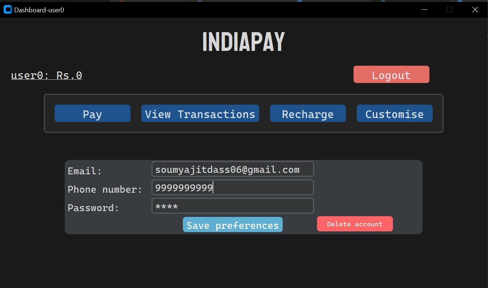

# IndiaPay 

IndiaPay is a GUI based banking application. It has almost all features that are required in a banking application like:

* Pay money
* Recharge
* view Dashboard
* Transaction history 
**_and few more..._**

---
---
## Security

* **OTP-** For Security purpose, OTP sending system to account's email is added.
* **Hashing password**- The password stored in server.py file remains hashed due to security

(all suggestions regarding the improvement of app is accepted)

---
---
## NOTE 
The software is made specifically by assuming that is will be executed from the 'mainscreen.py'. Trying to execute from  any file may lead to errors :)
---
---

# Screenshots

